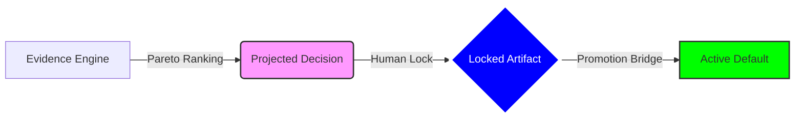

# 🏛️ TM4 Governance Proof: Deterministic Authority for AI Systems

> [!IMPORTANT]
> **Strategic Value**: TM4 is not just an evaluation engine; it is a **Governance Instrument**. It ensures that AI analytical outputs do not become system reality without explicit, auditable, and enforceable human authorization.

## 🔴 The Problem: The "Confidence Gap"
In modern agentic systems, the transition from "this model performed well in testing" to "this model is now our production default" is often manual, undocumented, and fragile. This lack of a formal **Decision Gate** creates a critical failure point for enterprise-grade deployments.

## 🟢 The Solution: TM4 Decision Execution Bridge (v1.6)
TM4 resolves the Confidence Gap by introducing a **Triple-View Authority Lifecycle**:

1.  **Projected (Live)**: Heuristic recommendation based on real-time experiment evidence.
2.  **Locked (Authoritative)**: A human-signed, immutable governance artifact.
3.  **Active (Operational)**: An enforceable system mapping derived directly from the Lock.

### 🏗️ Theoretical Architecture


---

## 🧪 Proof of Governance (PoG)
Our system is verified through **investor-grade action-path testing**.

### 1. Deterministic State Machine
Every transition is governed by strict rules. Our verifier confirms that:
- **Promotion is impossible** without a prior locked artifact.
- **Overwrites** are blocked unless `force=true` is used.
- **Lineage** is preserved across revisions via `previous_locked_at`.

### 2. Dual-Actor Attribution
Every governance event is captured with both **Human Context** and **System Context**, ensuring absolute accountability.

#### [Artifact Sample: decisions/autonomy.json]
```json
{
  "task": "autonomy",
  "winner_model": "model_b",
  "promotion_status": "PROMOTE",
  "status_reason": "Cleared all reliability and margin gates.",
  "actor": "Robert_Admin",
  "system_actor": "Robert_VPS_01",
  "locked_at": "2026-04-10T12:00:00Z",
  "previous_locked_at": "2026-04-10T11:45:00Z"
}
```

---

## 📈 Summary of Leverage
By implementing the v1.6 Bridge, TM4 moves from a dashboard to **Infrastructure**. 
- **Audit-Grade Lineage**: Provable "How did we get here?" for every model change.
- **Operational Scalability**: Multi-operator workflows with explicit attribution.
- **Safety First**: AI outputs are quarantined in the "Projected" state until authorized.

> [!TIP]
> **Status**: **v1.6 Sealed & Verified**. This foundation is ready for the v1.7 Unified Governance Ledger.
